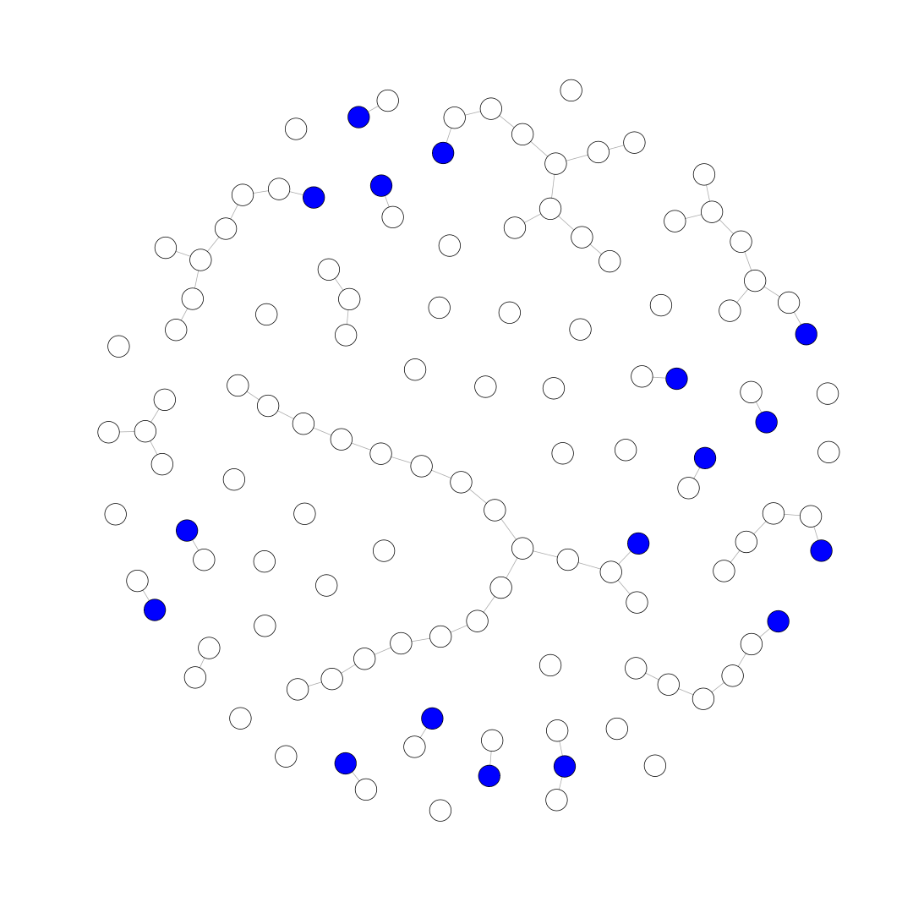
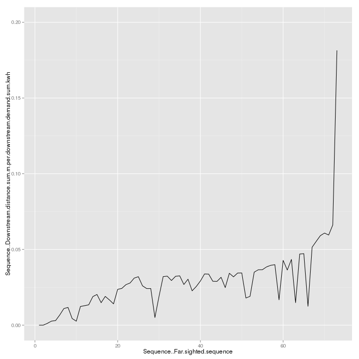

<link href="http://kevinburke.bitbucket.org/markdowncss/markdown.css" rel="stylesheet"></link>
Sequencing a Scenario via NetworkPlanner R library
==================================================

In this tutorial, we'll be taking the output of a NetworkPlanner scenario and sequencing it via the NetworkPlanner R library.  

About the Library
-----------------

The NetworkPlanner R library is an open source utility developed at [SEL](sel.columbia.edu) for analyzing NetworkPlanner outputs (and potentially other datasets) in R.  
You can learn more about it [here](https://github.com/SEL-Columbia/networkplanner.R)

Installation
------------

*You can skip this step if you have already installed the library*

To install the NetworkPlanner R library, you must install the [devtools](http://www.rstudio.com/products/rpackages/devtools/) package from the developers of R studio.
Once that's done, you can install our library.


```r
install.packages('devtools')
```

```
## Error: trying to use CRAN without setting a mirror
```

```r
library(devtools)
install_github("SEL-Columbia/networkplanner.R")
```

Setup
-----

Now that you have the library installed, you need to locate the directory containing the NetworkPlanner output that you want to work with.  
I'm using my scenario directory below, but yours may vary.  


```r
#Load the library first
library(networkplanner)

# Set the directory containing the output of a Network Planner
# scenario.  This will need to change depending on your files location
base_dir <- "~/src/ecreee_training/leona_500kwh_dmd"
```

Load
----
Load the NetworkPlanner scenario
"Fake" nodes, which represent connections to an existing network are blue.


```r
np <- read_networkplan(base_dir)
```

```
## OGR data source with driver: ESRI Shapefile 
## Source: "/home/cjn/src/ecreee_training/leona_500kwh_dmd", layer: "networks-proposed"
## with 70 features and 1 fields
## Feature type: wkbLineString with 2 dimensions
```

Plot (Optional)
---------------

This step is optional, but serves as a validation that you have loaded the network properly.  

The plot displays all nodes of the scenario, including those that are not actually
connected to the network.  


```r
V(np@network)[V(np@network)$Network..Is.fake]$color <- "blue"
plot(np@network, vertex.size=6, vertex.label="")
```

 

Sequence
--------

Sequence the networkplan via our model (`mv_v_dmd_sequence_model`).  
This model orders the vertices and edges via a combination of "network" order
and Downstream network length / Downstream demand (ascending, to connect
communities with most demand at least cost first)


```r
np <- sequence_plan_far(np, sequence_model=mv_v_dmd_sequence_model)

settlements <- get.data.frame(np@network, what="vertices")

ggplot(settlements, aes(Sequence..Far.sighted.sequence, 
  Sequence..Downstream.distance.sum.m.per.downstream.demand.sum.kwh)) +
  geom_line() + 
  ylim(0, 0.2)
```

```
## Error: could not find function "ggplot"
```

Plot Curve (Optional)
--------------------


```r
require(ggplot2)

settlements <- get.data.frame(np@network, what="vertices")

ggplot(settlements, aes(Sequence..Far.sighted.sequence, 
  Sequence..Downstream.distance.sum.m.per.downstream.demand.sum.kwh)) +
  geom_line() + 
  ylim(0, 0.2)
```

 

Write
-----

Now we can write the sequenced output for import into other tools like QGIS or Excel.  
We'll write it to the same directory that we loaded the scenario from (`base_dir`).


```r
write.NetworkPlan(np, base_dir)
```
